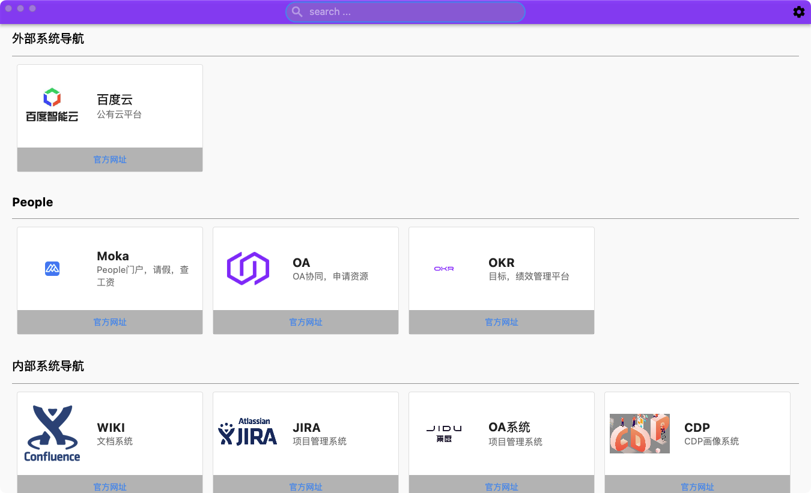

# hao123
A personal website navigation program .

## Build
```
flutter build macos --release
local:hao123 licong$ appdmg dmg.json 123.dmg
[ 1/21] Looking for target...                [ OK ]
[ 2/21] Reading JSON Specification...        [ OK ]
[ 3/21] Parsing JSON Specification...        [ OK ]
[ 4/21] Validating JSON Specification...     [ OK ]
[ 5/21] Looking for files...                 [ OK ]
[ 6/21] Calculating size of image...         [ OK ]
[ 7/21] Creating temporary image...          [ OK ]
[ 8/21] Mounting temporary image...          [ OK ]
[ 9/21] Making hidden background folder...   [ OK ]
[10/21] Copying background...                [SKIP]
[11/21] Reading background dimensions...     [SKIP]
[12/21] Copying icon...                      [ OK ]
[13/21] Setting icon...                      [ OK ]
[14/21] Creating links...                    [ OK ]
[15/21] Copying files...                     [ OK ]
[16/21] Making all the visuals...            [ OK ]
[17/21] Blessing image...                    [ OK ]
[18/21] Unmounting temporary image...        [ OK ]
[19/21] Finalizing image...                  [ OK ]
[20/21] Signing image...                     [SKIP]
[21/21] Removing temporary image...          [ OK ]
[22/21] Removing target image...             [ OK ]

Your image is ready:
123.dmg
```

